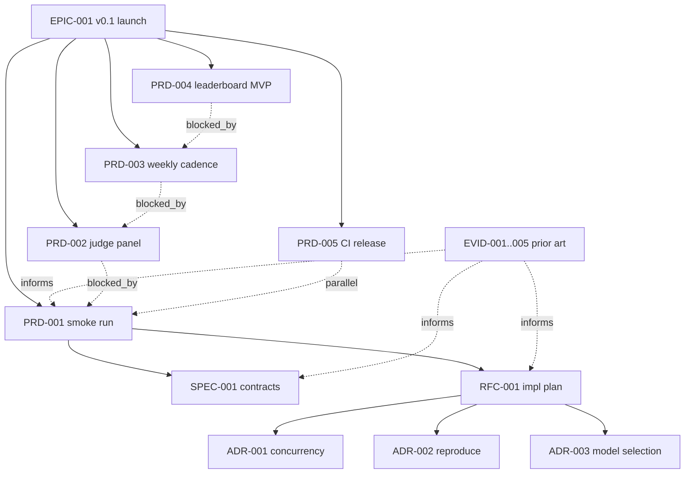

# EPIC-001: v0.1 launch — open eval evidence layer

## Progress

```
PRD-001 smoke run         ████████░░░░░░░░░░░░░░░░  3/8   ( 38%)
PRD-002 judge panel       ░░░░░░░░░░░░░░░░░░░░░░░░  0/6   (  0%)
PRD-003 weekly cadence    ░░░░░░░░░░░░░░░░░░░░░░░░  0/5   (  0%)
PRD-004 leaderboard MVP   ░░░░░░░░░░░░░░░░░░░░░░░░  0/4   (  0%)
PRD-005 CI release        █████░░░░░░░░░░░░░░░░░░░  1/4   ( 25%)
─────────────────────────────────────────────────
TOTAL                                              4/27 (14.8%)
```

Phase 1 (Foundation) actively in progress: PRD-001 + SPEC + RFC + ADRs + 5 EVIDENCE (prior art).

---

## Vision

Запустить публикуемый канал доказательств выбора production-LLM-стека: 2 weekly run'а подряд, прошедшие smoke → judges → leaderboard, с воспроизводимыми артефактами и зафиксированной inter-judge согласованностью.

## Outcomes (Measurable)

1. **End-to-end pipeline working**: 2 consecutive weekly runs publish без missing artifacts, deterministic scoring, reproducible manifests (T+8 weeks).
2. **Judge methodology validated**: Krippendorff α ≥ 0.70 на judge-panel в smoke + первом weekly run (T+4 weeks).
3. **Public evidence visible**: статичный leaderboard MVP с Pareto frontier (cost vs quality) для ≥3 stacks × ≥5 models × ≥3 task families опубликован на `pollmevals.com` (T+6 weeks).
4. **CI hardened**: 100% PR'ов проходят `moon ci` + lefthook гейты, 0 secret-leak инцидентов после внедрения (T+1 week, по факту уже сделано в parallel).

## Problem Space

Существующие eval-платформы (HELM, MTEB, lm-eval-harness, SWE-bench, Inspect AI) оценивают **раздельно**:
- **HELM/MTEB** — модели в изоляции (один промпт → один ответ), без скаффолдинга.
- **SWE-bench** — стек+модель часто публикуются как одна точка (SWE-agent+GPT-4), но leaderboard credit'ы атрибуцируют непрозрачно (имя в фолдере, не schema field).
- **Inspect AI** — каркас для оценки, но без публичного evidence layer и без cost attribution.

**Разрыв**: production-команда не может ответить на вопрос «какая связка модели + scaffolding окупится для нашего use-case» по существующим источникам — каждая платформа покрывает лишь часть. POLLMEVALS закрывает этот разрыв как **evidence layer над стеками**, не над моделями.

Дополнительная боль (выявлена MTEB-исследованием): даже признанные leaderboard'ы страдают от **vendor honor model** — submitter сам присылает score, технической верификации нет. POLLMEVALS должна снять эту уязвимость с первого дня: eval execution внутри собственного sandbox + content-addressed artifacts = eval engine, а не vendor, является authority.

## Scope

### In Scope (v0.1)

| PRD | Scope |
|-----|-------|
| **PRD-001** v0.1 smoke evaluation run | Proof пайплайна: 3 tasks × 5 models × 3 seeds = 45 evals на `raw-llm`, automatic metrics only, $50 budget. Без judges. |
| **PRD-002** judge panel layer | Поверх работающего smoke добавить JudgePanel: минимум 3 судьи разных vendor-семейств, никогда self-judging, median scoring, blind labels. |
| **PRD-003** weekly run cadence | Cron-триггер понедельник 03:00 UTC. Failure policy, retry semantics, alerting на drift. |
| **PRD-004** public leaderboard MVP | Статический Next.js сайт с per-stack scoring + Pareto frontier + drift alerts. Без публичных proposals (это v1.0). |
| **PRD-005** CI release pipeline | Полный release loop: `release/v*` → main → `chore/sync-main-to-dev`. Включает `assigned_number` бот для artifact ID финализации. |

### Out of Scope (v0.2+)

- **Tier-3 sponsored evals** — disclosure policy не готова, отложено до v1.0.
- **Rust sandbox runner** — по ADR-0001 откладывается до стабильности eval protocol (после 2+ weekly runs).
- **Paid API** — до 2 публичных runs с inter-judge α ≥ 0.70.
- **Multilingual tasks** — English only до стабилизации, локализация в v2.0.
- **Public community proposals** — добавление model/stack/task через PR, не через UI, до v1.0.
- **Enterprise white-label** — фокус на открытом evidence layer первым.
- **Direct vendor APIs** (Anthropic, OpenAI напрямую) — всё через OpenRouter в v0.x для унифицированной cost-attribution.

## Children (PRDs)

| Type | ID | Title | Status | Depth |
|------|------|-------|--------|-------|
| PRD | PRD-001 | v0.1 smoke evaluation run | draft (validate PASS) | deep (углубляется в этом эпике) |
| PRD | PRD-002 | judge panel layer | stub | standard |
| PRD | PRD-003 | weekly run cadence | stub | standard |
| PRD | PRD-004 | public leaderboard MVP | stub | standard |
| PRD | PRD-005 | CI release pipeline | stub | tactical |

Связанные структурные артефакты PRD-001 (создаются в этом эпике):
- SPEC-001 — manifest + eval + artifact contracts
- RFC-001 — implementation plan (concurrency, reproduce semantics, model selection)
- ADR-001 — concurrency model
- ADR-002 — reproduce semantics (evaluator-only vs full-pipeline)
- ADR-003 — v0.1 model selection
- EVID-001..005 — prior art research (HELM, MTEB, LM Harness, Inspect AI, SWE-bench)

## Dependency Graph



## Phases

### Phase 1: Foundation (T+0 to T+1 week) — current

- ✅ Infrastructure: hindsight hooks, CI workflow, lefthook pre-commit
- 🔄 PRD-001 Deep: SPEC-001, RFC-001, ADR-001..003
- 🔄 EVID-001..005 (5 prior art research)
- 🔄 Review-gate: architect-reviewer + guardian
- ⏳ Activate PRD-001 + dependents

### Phase 2: Smoke run execution (T+1 to T+2 weeks)

- Implement Python orchestrator (`apps/eval-core-py/`) per RFC-001 (built **on top of Inspect AI** — per EVID-004 findings)
- Wire LiteLLM proxy + 5 model adapters
- Execute 45-eval grid → manifest
- Reproduce verification
- Postmortem → activate PRD-001

### Phase 3: Judges layer (T+2 to T+4 weeks)

- PRD-002 deep development (judge selection, blind labels, calibration samples)
- Use Inspect AI's `multi_scorer(model_graded_qa(model=[...]))` with median reducer (per EVID-004)
- Krippendorff α target = 0.70
- Re-run smoke с judges → second postmortem

### Phase 4: Weekly cadence + leaderboard (T+4 to T+6 weeks)

- PRD-003 cron + alerting
- PRD-004 leaderboard MVP (Next.js, статика, Pareto frontier)
- First public weekly run

### Phase 5: Release hardening (T+6 to T+8 weeks)

- PRD-005 release pipeline (`assigned_number` bot, sync workflow)
- 2nd consecutive weekly run → доказательство стабильности
- Готовность к v1.0 planning

## Risks

| ID | Risk | Probability | Impact | Mitigation |
|----|------|-------------|--------|------------|
| ER-1 | Krippendorff α < 0.70 на первом judge run → нельзя публиковать | High | High | PRD-002 включает calibration step ДО публикации; α < 0.70 → итерация judge selection без публикации |
| ER-2 | Inter-провайдер instability (Cerebras / Runpod вышли из строя в момент cron) | Medium | Medium | Failure policy в PRD-003: store failed evals с error_class, не блокируем weekly run, опубликовать с пометкой `degraded` |
| ER-3 | OpenRouter pricing drift between runs ломает cost comparability | Medium | Medium | Snapshot pricing в manifest на момент run start (ADR-0002 immutability покрывает это) — gap, который HELM и SWE-bench не закрывают (EVID-001, EVID-005) |
| ER-4 | Reproduce script ломается из-за нестабильности LLM API (даже с seed) | High | Medium | ADR-002 (reproduce semantics) явно отделит "детерминизм evaluator'а" от "детерминизм LLM" — reproduce работает на cached raw_output (precedent: HELM `scenario_state.json`, LM Harness `--use_cache` SQLite) |
| ER-5 | Vendor contamination — модель видела одну из 3 smoke-задач | Medium | High | Inspired by MTEB: дисплей "in-distribution fraction" на leaderboard вместо blocking. Будущий ADR. |
| ER-6 | Insufficient time — solo maintainer, реальный velocity ниже plan | High | Medium | Этап Phase 1 уже идёт; если Phase 2 slip — двигаем Phase 4-5, не Phase 3 (judges критичны для credibility) |
| ER-7 | Inspect AI breaking changes — оркестратор зависит от внешнего фреймворка | Low | High | Pin version в pyproject.toml; собственная обёртка тонкая (immutability envelope + cost layer), миграция возможна на любой Inspect-совместимый каркас |

## Related

- `docs/04-runbook/12-first-smoke-run-playbook.md` — источник scope для PRD-001
- `docs/02-methodology/` — frozen v0.1.0, ссылается из всех 5 PRDs
- `docs/adr/0001-use-hybrid-stack.md` (legacy) — обоснование TS+Python разделения
- `docs/adr/0002-run-immutability.md` (legacy) — фундамент SC-2/SC-3/NFR-004 в PRD-001
- EVID-001..005 — prior art (создаются в Phase 1, см. children)

## Stakeholders

| Role | Name | Sign-off |
|------|------|----------|
| Product Owner / Maintainer | gogocat | [ ] |
| Methodology Reviewer (external) | TBD до v1.0 | [ ] |
| Sponsor (none in v0.x) | n/a | n/a |


