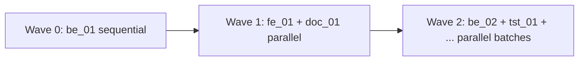

# RFC-003: Task-pack authoring protocol — team-lead dispatch + anti-SLOP G1-G4 gates

> **STATUS: draft (standard)** — operationalises PRD-006 (Tasks catalog expansion). Authored 2026-05-26 as Wave 0 protocol artifact before be_01 content authoring begins. Locks the process so Wave 1+ parallel agent dispatches do not diverge in quality.

## Summary

POLLMEVALS v0.1 needs 20 task packs (currently 3 scaffolds, 0 real content). PRD-006 prioritises Wave 1 = 7 high-impact tasks. Authoring is the **single biggest content bottleneck** of v0.1 (~136h estimate for Wave 1 alone, ~250 hand-authored calibration samples). To make this tractable without quality drift, we adopt a **team-lead dispatch protocol** with four mandatory anti-SLOP gates (G1 provenance, G2 score band, G3 diversity, G4 contamination — G4 blocking).

## Motivation

Without an explicit authoring protocol three failure modes dominate:

1. **Style drift across packs** — different agents author with different idioms, judges learn the idiom not the criterion.
2. **SLOP contamination** — LLM-generated calibration samples have surface uniformity (same variable names, identical structure across "10 perfect samples") which the judge panel will learn as the signal instead of true quality.
3. **Verbatim leak** — sample code or prompt fragments already exist on GitHub / Stack Overflow → judge panel previously saw them in pretrain → score reflects recall not capability.

The protocol below addresses each failure mode with a named gate.

## Options Considered

| Option | Approach | Verdict |
|---|---|---|
| **A. Free-form authoring** — each agent picks its own structure | Pros: fast. Cons: failure modes #1, #2 dominate; calibration distribution unusable. | REJECTED |
| **B. Single-template enforced authoring + gates** — chosen. Wave 0 establishes canonical template; Wave 1+ agents follow it; G1-G4 gates audit every sample. | Pros: consistent across packs; gates catch SLOP; provenance auditable. Cons: Wave 0 sequential (~6-8h); template fragility for non-coding tasks (docs, review). | **CHOSEN** |
| **C. Strict spec + LLM auto-generation** — write task.yaml + rubric, generate gold + 50 samples with an LLM | Pros: fastest. Cons: maximises SLOP risk (failure mode #2); G4 blocking gate would reject most samples; defeats anti-contamination thesis. | REJECTED |

## Proposed Direction

### Authoring topology

```
Team Lead (orchestrator)
  ├─ Wave 0 (sequential)
  │   └─ Canonical Author = Team Lead itself
  │       Outputs: 1 reference pack (be_01)
  │       Gates: G1-G4 on every artefact before lifecycle promotion
  │
  ├─ Wave 1+ (parallel via Agent({...}))
  │   ├─ Task-Pack Author Agent A → fe_01 (file ownership: evals/task-packs/fe_01/**)
  │   ├─ Task-Pack Author Agent B → doc_01 (file ownership: evals/task-packs/doc_01/**)
  │   └─ Author Agent C → next pack (when ready)
  │
  ├─ Evaluator Wiring Agent (per pack post-author)
  │   Reads: gold + 50 calibration. Writes: calibration.yaml expected_evaluator_scores
  │   Verifies: gold score >= 0.85, broken <= 0.20, mediocre between
  │
  ├─ Anti-SLOP Reviewer Agent (per pack post-wire)
  │   G1 Provenance: every file has `// source: <origin>` header
  │   G2 Score band: evaluator scores fall in expected band per quality level
  │   G3 Diversity: AST/structural hash; <=2 collisions per band
  │   G4 Contamination: WebSearch verbatim first 80 chars of code; 0 hits required (BLOCKING)
  │   Outputs: REVIEW.md with verdict PASS / CONCERNS / BLOCKER
  │
  └─ Promotion Agent (per pack on PASS verdict)
      Emits EVID via forgeplan; promotes task to "calibration" lifecycle state.
```

### File-ownership boundaries (race-condition-free parallelism)

Each Task-Pack Author Agent gets **exclusive write access** to `evals/task-packs/<slug>/`. No agent touches another's directory. Top-level shared files (CLAUDE.md, AGENTS.md, scoring.md, RFC-003 itself) are read-only for agents — only Team Lead modifies these.

### Anti-SLOP gates (G1-G4)

Detailed spec, applied to every sample in every pack:

**G1 — Provenance** (mandatory pre-author, blocking)
```typescript
// source: own-authored 2026-05-26 by gogocat (license: MIT)
// OR
// source: SWE-Lancer task #1234 (license: Apache-2.0, attribution preserved)
```
Header at top of every file. Reviewer greps for this header — file without it = automatic reject.

**G2 — Score band** (post-wire, blocking)

| Quality level | Expected evaluator score range | Gold score (in calibration.yaml) |
|---|---|---|
| perfect  | ≥ 0.85 on every applicable evaluator | 9.0-10.0 |
| good     | 0.70-0.85 across most evaluators     | 7.5-9.0 |
| mediocre | 0.40-0.65 mixed signal               | 5.0-7.5 |
| poor     | 0.15-0.35 below threshold            | 2.5-5.0 |
| broken   | ≤ 0.15 on ≥2 evaluators              | 0.0-2.5 |

Any sample whose actual evaluator score falls outside its band → relabel or rewrite.

**G3 — Diversity** (post-author, warn)

For each quality band, compute a structural-similarity hash per sample (Python: AST hash of top-level nodes; TS: ts-morph syntax kind list; Markdown: heading-and-paragraph structure). No more than 2 collisions within a band → if exceeded, rewrite the duplicates with different structural patterns (e.g., different control-flow shape, different decomposition, different error-handling style).

**G4 — Contamination** (post-author, **BLOCKING**)

For each sample, WebSearch the first 80 characters of the code body (verbatim, in quotes). Zero hits required. Any verbatim match → reject + rewrite the sample with intentional structural change.

Cost: ~50 searches per pack × 4 task packs = ~200 WebSearch calls (within rate limits but adds ~30-60 minutes per pack). Acceptable for v0.1 launch; future v0.2 may automate via cron.

### Wave ordering DAG

Wave 0 must complete before Wave 1 dispatches. Wave 1+ runs in parallel under file-ownership boundaries. Each pack independently passes through Wire → Review → Promote before being marked done.



## Implementation Phases

Each phase is one "task pack" delivered through:

1. Author task.yaml + rubric.yaml (Team Lead OR Author Agent depending on wave)
2. Author gold pack
3. Author 50 calibration samples (10 per quality level)
4. Evaluator wiring agent runs evaluators, fills expected_evaluator_scores
5. Anti-SLOP reviewer agent runs G1-G4
6. On PASS: promotion agent emits EVID + lifecycle update
7. On CONCERNS/BLOCKER: dispatch fix agent for failing samples ONLY (not whole pack)

## Test plan

| Layer | What is checked | How |
|---|---|---|
| Per-sample | G1 header present | grep on file |
| Per-sample | G4 contamination | WebSearch |
| Per-band | G2 score band | run evaluators, compare to band |
| Per-band | G3 diversity | structural hash count |
| Per-pack | Gold passes evaluator | run evaluator on gold/solution |
| Per-pack | Broken fails evaluator | run evaluator on broken samples |
| Per-pack | Mediocre between | score distribution check |
| Cross-pack | Style coherence | manual diff sample-001 across packs |

## Invariants

1. **One sample = one author**. Splitting authoring of a single sample across agents → loses coherence.
2. **G1 mandatory before sample lands on disk** — every Write of a calibration sample must include provenance header.
3. **G4 BLOCKING** — no exceptions. Verbatim match = rewrite.
4. **File-ownership boundaries** — no agent touches another pack's directory.
5. **Promotion gated on REVIEW.md = PASS**. CONCERNS verdict triggers fix-cycle, not promote.

## Rollback Plan

| Failure mode | Rollback |
|---|---|
| G4 hit on >50% of samples in a pack | Pause the pack, write ADR-007 update noting contamination risk for that category, rewrite with stricter own-authoring policy |
| Score-band drift discovered after promotion | New pack version (1.1) supersedes via task-lifecycle; old kept as historical |
| Multiple packs found correlated (judge confused 1↔1) | Revisit rubric.yaml across affected packs; emit superseding ADR |

## Related Artifacts

- PRD-006 — Tasks catalog expansion (parent; this RFC implements its authoring contract)
- ADR-007 — Sourcing policy (own-authored vs licensed import)
- NOTE-002 — Evidence Quality Standard (EVID emit per pack uses this contract)
- NOTE-007 — Static/dynamic evaluator boundary (G2 uses TypeSafety + Lint for static-side scoring)
- PRD-001 — Smoke run consumer
- RFC-002 — Judge panel layer (judges use this protocol's rubric.yaml)
- docs/02-methodology/task-lifecycle.md — lifecycle states this protocol promotes through
- docs/02-methodology/scoring.md — weight formulas this protocol's evaluator scores feed


